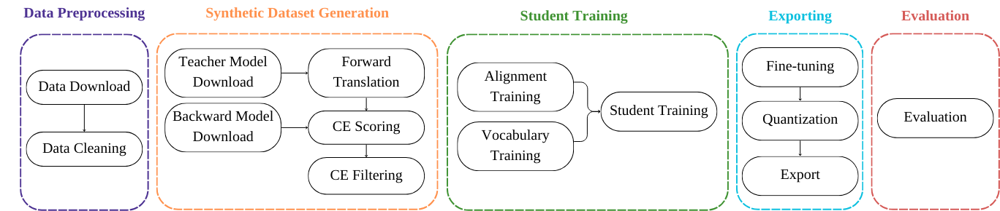

# QuickStart Tutorial

This is a quickstart tutorial to run the OpusDistillery pipeline from scratch in your local machine for learning purposes.
On this example, we will use OPUS-MT models for sequence-level distillation from a multilingual teacher into a multilingual student.

## Pipeline Overview

Next, you can see an overview of the pipeline steps:



It mainly has four steps:
* **Data Preprocessing**: downloads data from publicly available repositories and takes care of basic data cleaning.
* **Synthetic Dataset Generation**: downloads the relevant teacher and backward models, forward translates all source sentences with our teacher model(s) into our target languages, computes cross-entropy scores with a backward model and then use them for filtering the synthetic dataset.
* **Student Training**: trains a small transformer model on the filtered synthetic dataset with guided alignment. 
* **Evaluation**: evaluates the trained model.

For a more detailed description of the pipeline, check the [Pipeline Steps](pipeline/steps.md) section.

## Pipeline Setup

For this tutorial, we will be running the pipeline locally. 

1. Clone the repository and checkout to the multilingual branch `multi-ftt`

  ```bash
  git clone https://github.com/Helsinki-NLP/OpusDistillery.git
  git checkout multi-ftt
  ```

2. Install Mamba - fast Conda package manager

  ```
  make conda
  ```

3. Install Snakemake

  ```
  make snakemake
  ```

4. Update git submodules

  ```
  make git-modules
  ```

  micromamba activate /home/degibert/Documents/0_Work/mambaforge
  mamba activate snakemake

5. Edit the local profile from [profiles/local/config.yaml](../profiles/local/config.yaml)' and enter the data directory path as the root value of the config section. This is the folder where all the outputs of the pipeline will be stored.

  ```
  root=/home/degibert/Documents/0_Work/OpusDistillery/data
  ```

6. Make sure that everything is installed properly

  ```
  source ../mambaforge/etc/profile.d/conda.sh ; conda activate ; conda activate snakemake
  pip install -r requirements.txt
  make dry-run CONFIG="configs/config.quickstart.yml" PROFILE="local"
  ```

##  Experiment Setup

Let's define a simple configuration file in YAML format. We will be using the [configs/config.quickstart.yml](../configs/config.quickstart.yml).

1. We define the directory structure (`data-dir/test/fiu-eng`) and specify the language pairs of the student model we want to distill.

  ```yaml

  experiment:
    dirname: test
    name: fiu-eng
    langpairs:
      - et-en
      - fi-en
      - hu-en
  ```

2. We define the OPUS-MT models that we want to use for forward translation and for backward scoring:

  ```yaml
  #URL to the OPUS-MT model to use as the teacher
  opusmt-teacher: "https://object.pouta.csc.fi/Tatoeba-MT-models/fiu-eng/opus4m-2020-08-12.zip"

  #URL to the OPUS-MT model to use as the backward model
  opusmt-backward: "https://object.pouta.csc.fi/Tatoeba-MT-models/eng-fiu/opus2m-2020-08-01.zip"
  ```

  The backward model is multilingual at the target side, it has multiple target languages, so we need to specify it:

  ```yaml
  one2many-backward: True
  ```

3. We define the metric to select our best model.

  ```yaml  
    best-model: perplexity
  ```

4. We define the maximum lines for splitting our files for forward translation.

  ```yaml  
    split-length: 1000
  ```

## Running the pipeline

To run the pipeline, run:

```bash
make run CONFIG="configs/config.quickstart.yml" PROFILE="local"
```

You can also create a directed acyclic graph to represent the steps the pipeline will take.

```bash
make dag CONFIG="configs/config.quickstart.yml" PROFILE="local"
```

This will create a pdf in the root directory, named DAG.pdf, with the steps for this specific run.

By default, all Snakemake rules are executed. To run the pipeline up to a specific rule use:

```bash
make run CONFIG="configs/config.quickstart.yml" PROFILE="local" TARGET="/home/degibert/Documents/0_Work/OpusDistillery/data/data/test/fiu-eng/original/et-en/devset.source.gz"
```